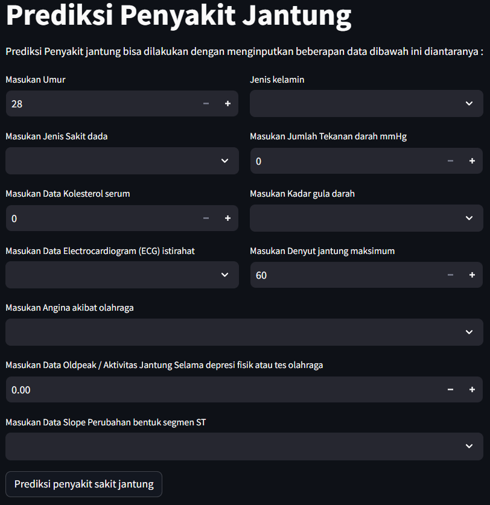

# Laporan Proyek Machine Learning
### Nama : Ari Supriatna
### Nim : 211351023 
### Kelas : Malam B

## Domain Proyek

Dijaman sekarang ini banyak masyarakat tidak memperhatikan kesehatan, dikarenakan asik bermain gadget dan memakan makanan yang cepat saji (instan) / bernilai gizi rendah, maka dari itu diperlukan adanya suatu sistem yang dapat memprediksi kesehatan jantung masyarakat dengan mudah dan akurat.

### Rubrik/Kriteria Tambahan
Dari latar belakang yang sudah di paparkan, maka dari itu proyek ini dibuat sistem tentang prediksi kesehatan jantung
Menurut hasil survey databoks tahun 2022 Tercatat, perempuan yang mengonsumsi fast food sebanyak satu kali dalam seminggu sebanyak 55,5%, sedangkan pria hanya 44,5%. Lalu, perempuan yang mengonsumsi makanan cepat saji 2-3 kali seminggu mencapai 53,8%, sedangkan laki-laki 46,2%.
Namun, perempuan yang mengonsumsi fastfood sebanyak 4-5 kali seminggu hanya 29,4%, sisanya laki-laki sebanyak 70,6%. Kemudian, perempuan kembali mendominasi pada intensitas mengonsumsi fastfood sebanyak 6-7 kali seminggu sebanyak 57,1%, sedangkan laki-laki 42,9%.

Referensi: [Perempuan Lebih Sering Konsumsi Makanan Cepat Saji Ketimbang Laki-laki](https://databoks.katadata.co.id/datapublish/2023/02/16/Perempuan-lebih-sering-konsumsi-makanan-cepat-saji-ketimbang-laki-laki) 

## Business Understanding

Bertujuan Untuk membantu dan memudahkan team medis dalam mendiagnosis penyakit jantung.

### Problem Statements

Penyakit jantung ini setiap tahunnya terus meningkat dan menempati peringkat tertinggi penyebab kematian di indonesia terutama pada usia usia produktif, maka dari itu disitem ini bisa memprediksi resiko terkena penyakit jantung

### Goals

Tujuan dari proyek ini adalah : 

  - Membantu tim medis dalam mendiagnosis penyakit jantung
  - Membantu masyarakat lebih penduli terhadap kesehatan jantung 

### Rubrik/Kriteria Tambahan

Dengan masyarakat mengetahui kesehatan jantungnya masyakarat akan lebih peduli terhadap pola hidupnya dan ketika diketahui kurang sehat maka diharapkan masyarakat untuk segera melakukan pemerikasaan ke dokter agar tidak tambah parah

### Solution statements
  
Masyarakat nantinya akan diberikan beberapa pertanyaan tentang gejala yang dirasakan saat ini, nantinya aplikasi akan menghitung presentase gejala yang memunuhi dia punya masalah penyakit jantung atau tidak. 

## Data Understanding
Dataset "Heart Failure Prediction"ini adalah hasil total data observasi 1190 kali dan di duplikasi sebanyak 272 kali observasi dan final datasetnya : 918 observations

[Heart Failure Prediction Dataset](https://www.kaggle.com/datasets/fedesoriano/heart-failure-prediction/data).

### Variabel-variabel pada Heart Disease Prediction adalah sebagai berikut:

1. **Age**   : Umur pasien dalam tahun._`int64`_

2. **Sex**   : Jenis kelamin pasien (M: Laki-laki, F: Perempuan)._`int64`_

3. **ChestPainType**   : Jenis nyeri dada yang dirasakan oleh pasien (TA: Angina Tipikal, ATA: Angina Atipikal, NAP : Nyeri Non-Anginal, ASY: Asimtomatik)._`int64`_

4. **RestingBP**   : Tekanan darah istirahat pasien dalam satuan mm Hg._`int64`_

5. **Cholesterol**   : Kolesterol serum dalam darah pasien dalam satuan mm/dL._`int64`_

6. **FastingBS**   : Kadar gula darah puasa (1: Jika lebih dari 120 mg/dL, 0: Jika tidak)._`int64`_

7. **RestingECG** : Hasil elektrokardiogram (Normal: Normal, ST: Terdapat abnormalitas gelombang ST-T seperti inversi gelombang T atau elevasi atau depresi ST sebesar >0.05 mV, LVH: Kemungkinan atau pasti ada pembesaran ventrikel kiri berdasarkan kriteria Estes')._`int64`_

8. **MaxHR** : Detak jantung maksimum yang dapat dicapai oleh pasien (nilai numerik antara 60 hingga 202)._`int64`_

9. **ExerciseAngina**   : Apakah pasien mengalami angina yang dipicu oleh latihan (Y: Ya, N: Tidak)._`int64`_

10. **Oldpeak**   : Nilai depresi ST (numerik) yang diukur selama tes stres._`floa64`_

11. **ST_Slope**   : Kemiringan segmen ST pada puncak aktivitas stres (Up: Miring ke atas, Flat: Datar, Down: Miring ke bawah)._`int64`_

12. **HeartDisease**   : Kelas keluaran (1: Penyakit jantung, 0: Normal)._`int64`_

## Data Preparation

Dihatap ini saya menggunakan preparation dengan metode Exploratory Data Analysis (EDA)

### Persiapan kerja dengan kaggle

Disini saya menggunakan google colaboratory, yang dimana saya akan meng upload file kaggle.json yang akan digunakan untuk men download dataset dari kaggle 

```python
from google.colab import files
files.upload()
```
File kaggle.json sudah diupload, langsung saja membuat direktori / folder untuk menyalin file kaggle.json ke direktori tersebut kemudian diupload di filenya

```python
!mkdir -p ~/.kaggle
!cp kaggle.json ~/.kaggle/
!chmod 600 ~/.kaggle/kaggle.json
!ls ~/.kaggle
```

### Men Download Dataset
Untuk persiapan kaggle sudah selesai, kemudian disini saya akan download file kagglenya diantaranya : 

```python
!kaggle datasets download -d fedesoriano/heart-failure-prediction
```

### Mengextrack file 
Setelah file kaggle sudah kedownload disini saya akan melakukan ekstrak data dan menyimpan data juga ke dalam direktori heart-failure-prediction

```python
!mkdir heart-failure-prediction
!unzip heart-failure-prediction.zip -d heart-failure-prediction
!ls heart-failure-prediction
```

### Library yang digunakan 
Kemudian disini saya akan mengimporkan data library yang akan digunakan diantaranya : 

```python
import numpy as np
import pandas as pd
import matplotlib.pyplot as plt
import seaborn as sns

from sklearn.model_selection import train_test_split
from sklearn.linear_model import LogisticRegression
from sklearn.metrics import accuracy_score
```

### Menginisialisasi Dataframe
Disini saya akan Menginisialisasi Dataframe dengan perintah :

```python
df = pd.read_csv('heart-failure-prediction/heart.csv')
```

Kemudian saya akan melihat tipe data yang digunakan setiap kolom nya dengan perintah : 

```python
df.info()
```

### Pemeriksaan lanjutan 
Selanjutnya saya akan melakukan pengecekan dataframe untuk memastikan tidak ada data yang bernilai null dengan perintah : 

```python
sns.heatmap(df.isnull())
```


Alhasil tidak ada data yang bernilai null dan data terlihat aman, disini saya akan mengecek matrik korelasi nya dengan peritnah : 

```python
sns.heatmap(df.corr(), annot=True)
```


## Modeling
Ditahap ini saya akan membuat feature dari semua kolom dengan perintah berikut : 

```python
x = df.drop(columns="HeartDisease", axis=1)
y = df["HeartDisease"]
```

Dibagian ini saya akan melakukan pembagian dataset menjadi dua, yaitu data train set dan data test set dengan printah : 

```python
x_train, x_test, y_train, y_test = train_test_split(x, y, test_size=0.20, random_state=0)
```

Selanjutnya saya akan membuat sebuah model menggunakan algoritma logisticRegression dengan jumlah iterasi max 5000 dengan perintah : 

```python
model = LogisticRegression(max_iter=5000)
```

Kemudian ditahapan ini saya akan mencoba melakukan prediksi dengan data sample yang paling atas dengan perintah : 

```python
input_data =  np.array([48,	0,	0,	138,	214,	0,	1,	108,	1,	1.5,	1])

input_data_reshaped = input_data.reshape(1,-1)
prediction = model.predict(input_data_reshaped)
print(prediction)
if (prediction[0] == 0) :
    print("Pasien tidak terindikasi Penyakit jantung")
else :
    print("Pasien terindikasi Penyakit jantung") 

```

dengan hasil prediksi sebagai berikut : 

[1]
Pasien terkena penyakit penyakit jantungi
/usr/local/lib/python3.10/dist-packages/sklearn/base.py:439: UserWarning: X does not have valid feature names, but LogisticRegression was fitted with feature names
  warnings.warn(


Dan yang terakhir adalah saya akan mengexport model ini menjadi sebuah file .sav untuk digunakan di aplikasi streamlit dengan perintah : 

```python
import pickle
filename = 'heart.sav'
pickle.dump(model, open(filename, 'wb'))
```


## Evaluation
Di tahap Evaluation ini saya akan menggunakan accuracy_score untuk metrik evaluasinya, dengan perintah : 

```python
x_train_prediction = model.predict(x_train)
training_data_accuracy = accuracy_score(x_train_prediction, y_train)
```

Dan disini juga saya akan menampilkan hasil pengecekan data akurasinya dengan perintah : 

```python
print("Akurasi data training : ", training_data_accuracy)
```

Berikut hasil akurasinya : 

Akurasi data training :  0.8596730245231607


## Deployment


https://appheart-failurepredictiondataset-goqwbbwhmx4zkeuqncxnix.streamlit.app/
